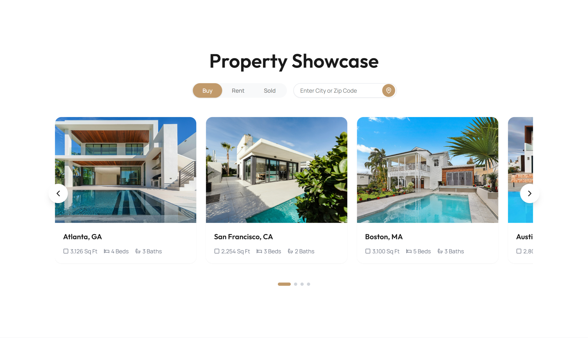
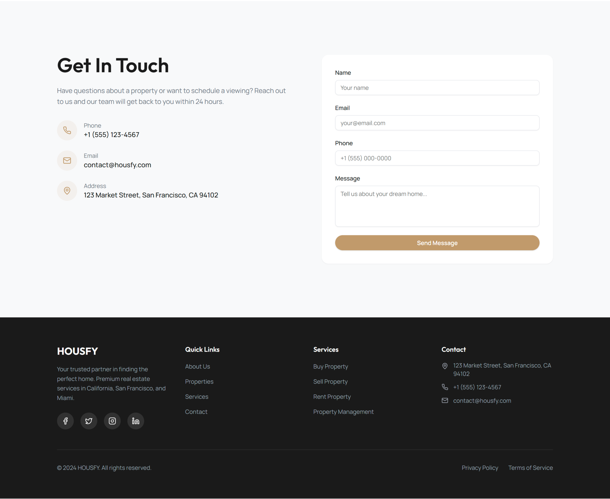

# 🏡 HOUSFY - Premium Real Estate Landing Page





<p align="center">
  <strong>A modern, high-performance real estate landing page built with React and Tailwind CSS.</strong>
</p>

## 📖 Description

**HOUSFY** is a premium real estate landing page designed to showcase luxury properties. Built with React, Tailwind CSS, and Framer Motion, it delivers a seamless user experience with scroll-triggered animations, interactive property showcases, and an accessible, mobile-first design system powered by Radix UI.

Whether you are browsing for your dream home or looking for commercial properties, HOUSFY provides a visually stunning layout to explore listings across the hottest markets like California, San Francisco, and Miami.

## ✨ Key Features

- **Interactive Property Showcase:** Uses Radix Tabs to categorize properties and enables modern horizontal scrolling (`overflow-x-auto`) to let users intuitively discover listings without pagination.
- **Smooth Viewport Animations:** The `AnimatedSection` wrapper uses Framer Motion's `useInView` to ensure text and property cards elegantly enter the screen only when the user scrolls to them.
- **Complex Grid Orchestration:** Uses a CSS Grid to organize the "Featured Properties" into a prominent main highlight card and a column of visually secondary choices with glass-morphic hover reveals.
- **Dynamic Transparent Navigation:** A sleek, mobile-friendly sticky header that smoothly transitions from transparent to solid white upon user scrolling.
- **Accessible UI Components:** Utilized Radix UI primitives and Tailwind CSS to craft highly customized, accessible components like tabs, forms, and dialogs.
- **Immersive Hero Section:** Engages users immediately using a full-viewport background image combined with a floating abstract statistics card.

## 🛠️ Minimum Requirements

To run this project locally, ensure you have the following installed:

- **Node.js**: `18.0.0` or higher
- **Package Manager**: `yarn` version `1.22+` (configured in `package.json`)
- **React Requirements**: React `19.0.0+` & ReactDOM `19.0.0+`
- **Browser**: Any modern web browser (Chrome, Firefox, Safari, Edge)

## 🚀 How to Run the Project

Follow these steps to get the project up and running on your local machine:

### 1. Clone the repository

```bash
git clone <your-repo-url>
cd real-estate-landing
```

### 2. Install dependencies

Using Yarn (Recommended):

```bash
yarn install
```

### 3. Start the development server

```bash
yarn start
```

The application will launch on `http://localhost:3000`. The page will reload when you make changes.

### 4. Build for production (Optional)

To build the app for production to the `build` folder:

```bash
yarn build
```

---

_Crafted beautifully with React & Tailwind CSS._
